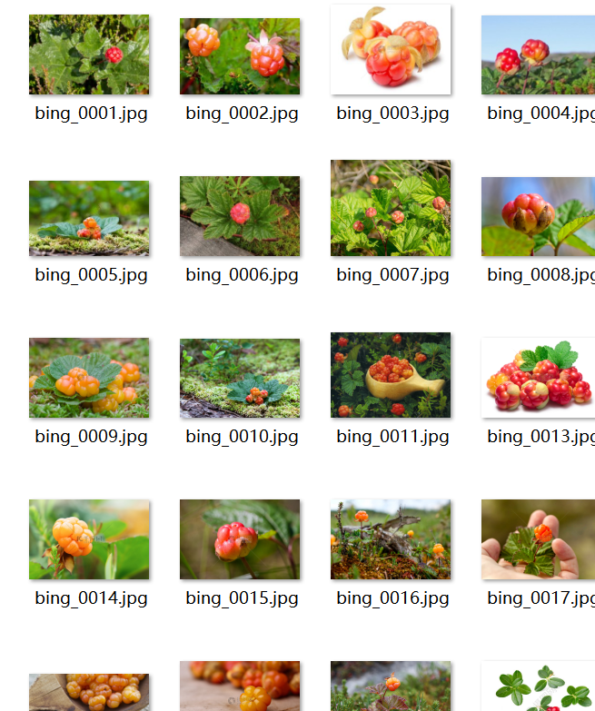
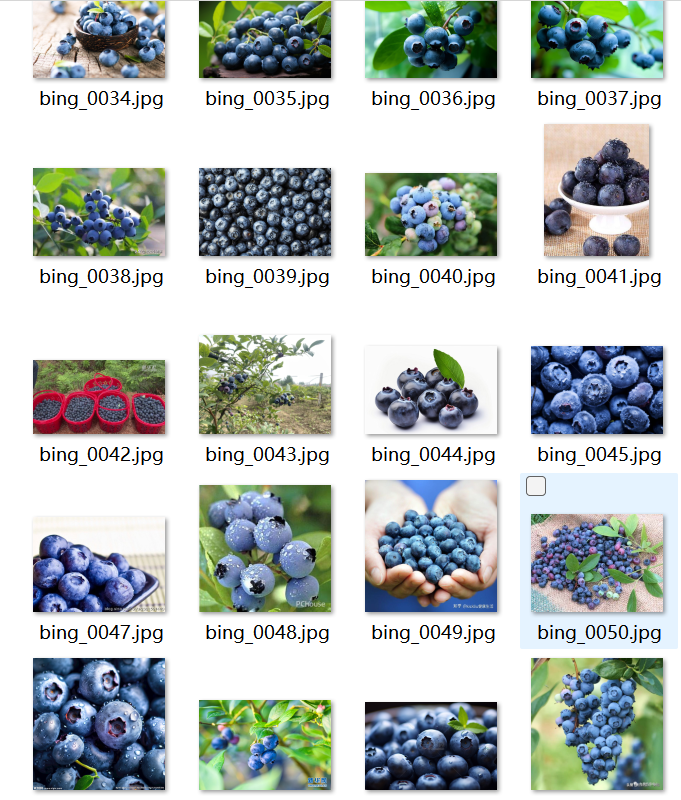
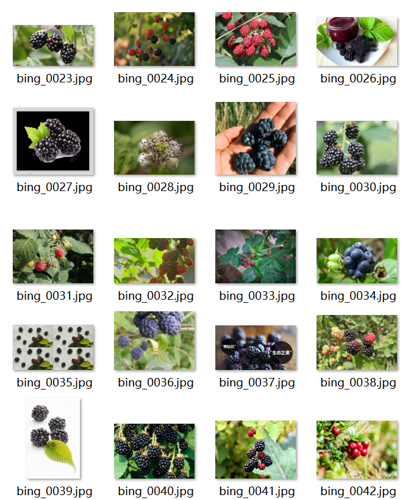
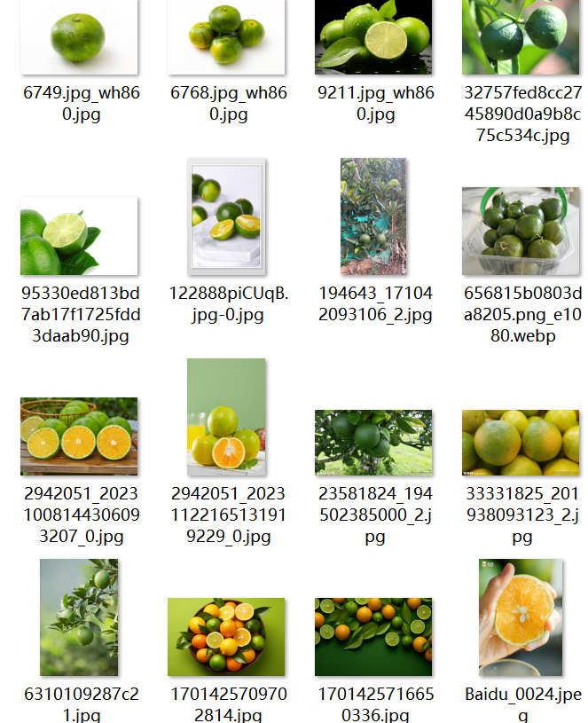
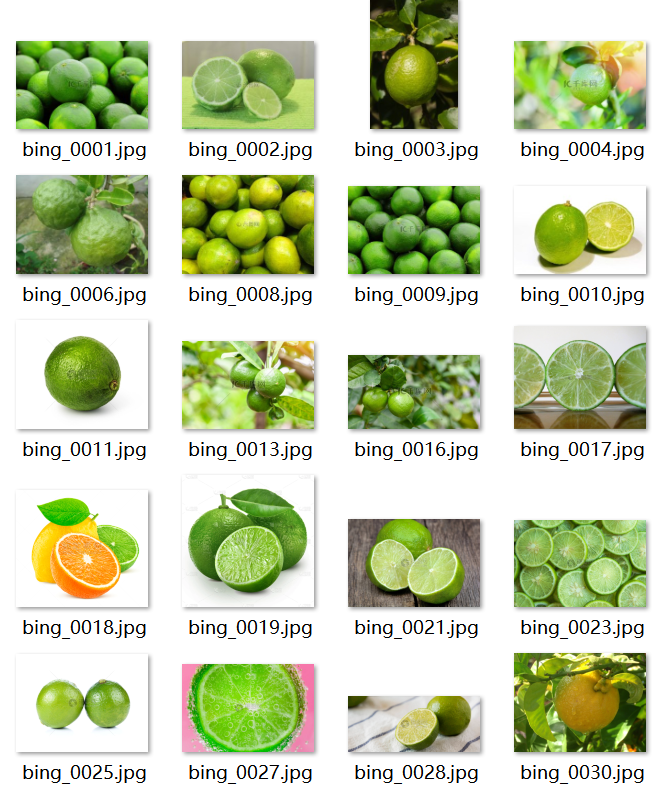
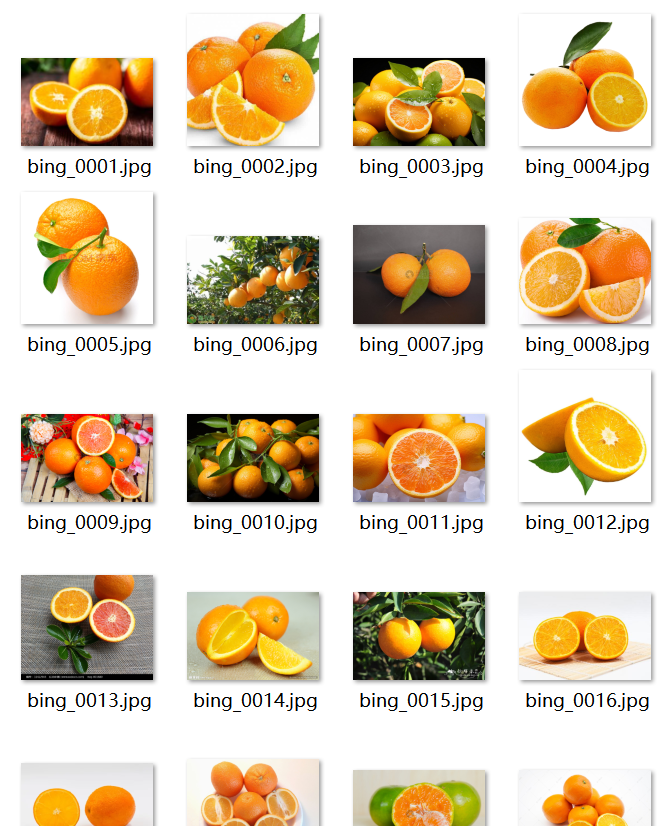
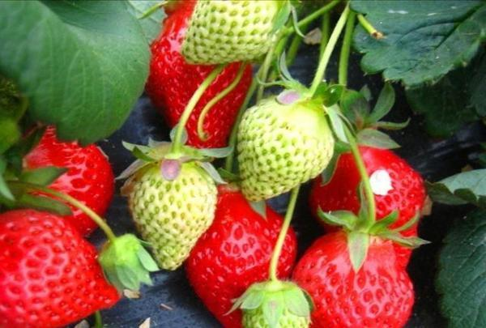
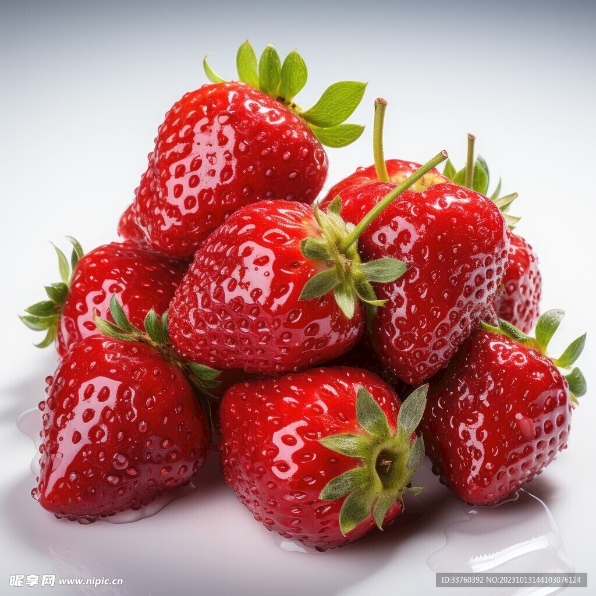
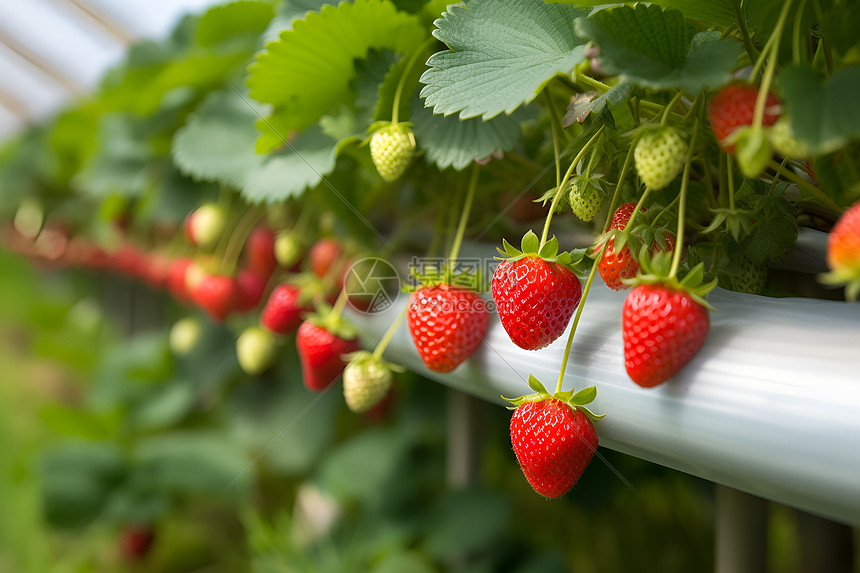
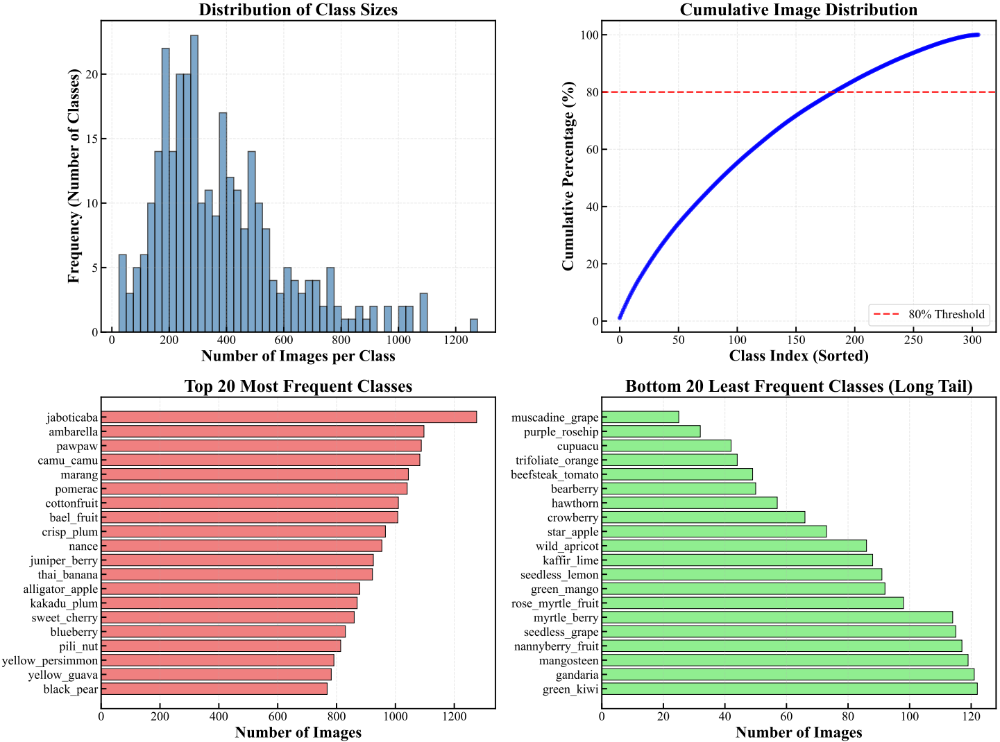

# 🍎 Fruit-306: A Large-Scale Multimodal Fruit Dataset & FruitEnsemble Framework

<div align="center">

[](LICENSE)
[]()
[]()
[](https://mybkgjvgnd.github.io/Fruit-306-Dataset/)

**A new benchmark for fine-grained fruit recognition with MLLM-guided ensemble arbitration.**

[📄 Anonymous Paper & Project Page](https://mybkgjvgnd.github.io/Fruit-306-Dataset/) | [📥 Download Data](#-download--preparation)

</div>

---

## 📖 Overview

**Fruit-306** is a comprehensive, large-scale dataset designed to advance research in **Fine-Grained Visual Categorization (FGVC)** within the agricultural domain. Unlike existing datasets that suffer from limited classes or controlled backgrounds, Fruit-306 offers:

*   🌟 **306 Fine-Grained Classes**: Covering a wide variety of fruit cultivars with distinct species and varieties
*   🌍 **Real-World Complexity**: 116,233 images captured in diverse environments with varying lighting, occlusions, and complex backgrounds
*   📉 **Long-Tail Distribution**: Imbalance ratio of 50:1 (max: 1,276 images for jaboticaba, min: 25 images for muscadine_grape)
*   📝 **Multimodal Annotations**: Images paired with expert-curated textual morphological descriptions
*   🤖 **FruitEnsemble Framework**: A novel dynamic two-stage framework using MLLM (Qwen-VL-Plus) as an arbiter for ambiguous samples

---

## 📊 Dataset Statistics

| Feature | Statistics | Description |
|:---|:---:|:---|
| **Total Classes** | **306** | Distinct fruit cultivars |
| **Total Images** | **116,233** | High-resolution real-world images |
| **Train/Val/Test Split** | 70% / 10% / 20% | 81,223 / 11,488 / 23,522 images |
| **Max Class Size** | 1,276 | Jaboticaba |
| **Min Class Size** | 25 | Muscadine grape |
| **Imbalance Ratio** | 50:1 | Severe long-tail distribution |
---

> **Comparison**: Fruit-306 significantly outperforms existing datasets like *Fruits-360* (limited classes, clean background) and *VegFru* (lack of text/segmentation) in terms of scale, complexity, and modality richness.

### Comparison with Existing Datasets

| Dataset | Classes | Images | Real-world | Multi-modal | Long-tail | Fine-Grained |
|:---|:---:|:---:|:---:|:---:|:---:|:---:|
| **Fruit-306 (Ours)** | **306** | **116k** | ✅ | ✅ | ✅ | ✅ |
| Fruits-360 [28] | 131 | 90k | ❌ | ❌ | ❌ | ❌ |
| VegFru [19] | 292 | 160k | ✅ | ❌ | ✅ | ✅ |
| PlantVillage [27] | 38 | 54k | ❌ | ❌ | ❌ | ❌ |
---

## 🖼️ Sample Visualization

Below are representative examples from the Fruit-306 dataset, showcasing the diversity across **different growth stages**, **environmental conditions**, and **fine-grained categories**.

<div align="center">
  <table>
    <tr>
      <td colspan="3" align="center"><b>🍓 Berray Varieties- Fine-Grained Differences</b></td>
    </tr>
    <tr>
      <td align="center">
        
        <br><i>cloudberry</i>
      </td>
      <td align="center">
        
        <br><i>blueberry</i>
      </td>
      <td align="center">
        
        <br><i>dewberry</i>
      </td>
    </tr>
    <tr>
      <td colspan="3" align="center"><b>🍊 Citrus Varieties - Shape & Color Variations</b></td>
    </tr>
    <tr>
      <td align="center">
        
        <br><i>sweet_orange</i>
      </td>
      <td align="center">
        
        <br><i>lime</i>
      </td>
      <td align="center">
        
        <br><i>green_orange</i>
      </td>
    </tr>
    <tr>
      <td colspan="3" align="center"><b>🌱 Different Growth Stages & Scenes</b></td>
    </tr>
    <tr>
      <td align="center">
        
        <br><i>Strawberry (Unripe)</i>
      </td>
      <td align="center">
        
        <br><i>Strawberry (Ripe)</i>
      </td>
      <td align="center">
        
        <br><i>Strawberry (Harvest Scene)</i>
      </td>
    </tr>
  </table>
</div>

<div align="center">
  <table>
    <tr>
      <td align="center">
        
        <br><i>Figure: Long-tail distribution across 306 fruit classes</i>
      </td>
    </tr>
  </table>
</div>

> **Key Features Demonstrated:**
> - **Fine-grained distinctions** between visually similar varieties (e.g., different apple types)
> - **Temporal diversity** capturing fruits from unripe to ripe stages
> - **Environmental variability** including natural occlusions, complex orchard backgrounds, and lighting changes
> - **Real-world conditions** that challenge traditional classification models

*(Note: Please replace the example image paths with your actual dataset samples. Recommended to include 2-3 representative images per fruit category showing different conditions.)*
---

## 📊 Benchmark Results

### Baseline Performance Comparison

| Model | Top-1 Acc | Top-5 Acc | Params (M) | Latency (ms) |
|:---|:---:|:---:|:---:|:---:|
| GoogleNet [31] | 0.6240 | 0.8164 | 6.8 | 8.2 |
| VGG16 [30] | 0.5860 | 0.7595 | 138.0 | 22.4 |
| Inceptionv3 [32] | 0.1635 | 0.2763 | 23.8 | 14.1 |
| Xception [6] | 0.5830 | 0.7493 | 22.9 | 16.5 |
| InceptionResNetV2 [33] | 0.6734 | 0.8062 | 55.9 | 25.6 |
| **ResNet50 [17]** | **0.6503** | **0.8658** | **25.6** | **12.5** |
| **DenseNet201 [21]** | **0.6850** | **0.8802** | **20.0** | **18.2** |
| **EfficientNetB7 [34]** | **0.6283** | **0.8916** | **66.3** | **45.6** |
| **ViT-B/16 [9]** | **0.5969** | **0.8831** | **86.6** | **32.4** |
| Qwen-VL-Plus [36] | 0.5638 | - | API | 1250 |
| **FruitEnsemble (Ours)** | **0.7049** | **0.9150** | - | **19.8** |

### Ablation Study

| Configuration | Heterogeneous Ensemble | TTA | LLM Arbiter | Top-1 Acc (%) |
|:---|:---:|:---:|:---:|:---:|
| Baseline (ResNet50) | - | - | - | 65.03 |
| + Heterogeneous Ensemble | ✓ | - | - | 68.50 |
| + Test-Time Augmentation | ✓ | ✓ | - | 68.92 |
| **+ LLM Arbitration (Ours)** | ✓ | ✓ | ✓ | **70.49** |

## 📥 Download & Preparation

Due to the large size of the dataset (~23GB+), the image files are hosted externally. Please download them using the links below and organize the directory structure as shown.

### 1. Download Links

| Source | Link | Notes |
| :--- | :--- | :--- |
| **Baidu Netdisk** | [点击下载](https://pan.baidu.com/s/18K6sAzKoBi-LBsXQcYLg6w?pwd=th9a) (提取码: `th9a`) | For users in China |
| **Project Page** | [https://mybkgjvgnd.github.io/Fruit-306-Dataset/](https://mybkgjvgnd.github.io/Fruit-306-Dataset/) | Alternative access |
### Directory Structure

After downloading, organize your local directory as follows:

```text
Fruit-306/
├── train/                # Training images (81,223 images)
│   ├── class_001/        # e.g., jaboticaba
│   ├── class_002/        # e.g., red_fuji
│   └── ...                # 306 class folders total
├── val/                  # Validation images (11,488 images)
│   ├── class_001/
│   ├── class_002/
│   └── ...
├── test/                 # Test images (23,522 images)
│   ├── class_001/
│   ├── class_002/
│   └── ...
├── fruit_name_mapping.txt # Mapping of class IDs to fruit names (Chinese/English)
└── dataset_info.txt       # Dataset statistics and metadata
